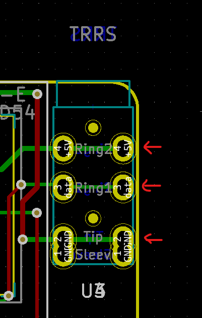

# Pronunciation

Lua Keyboard (luakeeb)

This is a reversible 95mm x 138mm pcb with support for mx switches (no hotswap), per key led, rotary encoders, and exposes the SDA/SCL/GND/VCC lines in the form of the pimoroni trackball pins (meaning you can add that as well, though the case doesn't support it, so you'll need to devise your own mechanism).

Note that the 6th column can be broken off. The only thing you need to do is (if using per key leds) solder the jumper near the bottom outside of the board, near the mounting hole. You should solder the jumper on the bottom side of the board (if left half, bottom side of the left half, if right half, bottom side of the right half)

# Support me!

I have spent a lot of time and money designing prototypes, testing, developing, etc. Any contributions would be greatly appreciated!

If you don't want to, or can't afford to support me, please send me a message to let me know you've built one, along with pictures. Also, feel free to submit a pull request with pictures into this repository. I'd be happy to showcase your build.

Reddit: /u/sadekbaroudi
Discord: sadekbaroudi#1258

# Monoblock support

This keyboard has the exact same layout as the ffkb ( https://github.com/sadekbaroudi/ffkb )

It was designed in such a way that it is perfectly compatible with the ffkb case. The only considerations are:
* The usb port on ffkb is in the center. In this case, you have two (one for each half). You'll need to cut out a spot on each half to allow you to plug it in.
* The trrs jacks need cut outs as well. However, if you don't care about splitting them up, you can solder the halves together instead of using jacks. In the image below, just solder the outer pins to each other, as indicated by the arrows in the image below.

# Firmware

Link below. Remember that the left and right half use different firmware due to the fact that the diode direction is flipped between the halves. I created two configs, one for the left, and one for the right. If you copy the config.left.h/config.right.h to config.h before building, it will generate the appropriate firmware for that half.

I made a script to make this simpler if you run your builds in linux:
https://github.com/sadekbaroudi/qmk_firmware/blob/master/bin/build-luakeeb-default.sh

The general folder for the firmware is here:
https://github.com/sadekbaroudi/qmk_firmware/tree/master/keyboards/xoiviox/luakeeb/

# Pictures

